30分钟tabata跟练
---
每个动作20s，间歇10s
1. 胯下击掌：https://www.bilibili.com/video/BV1oQTnzXEDr?t=25.8
    * 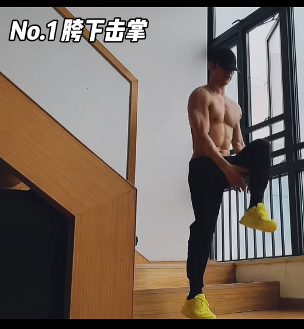
2. 提膝下压：https://www.bilibili.com/video/BV1oQTnzXEDr?t=50.1
    * 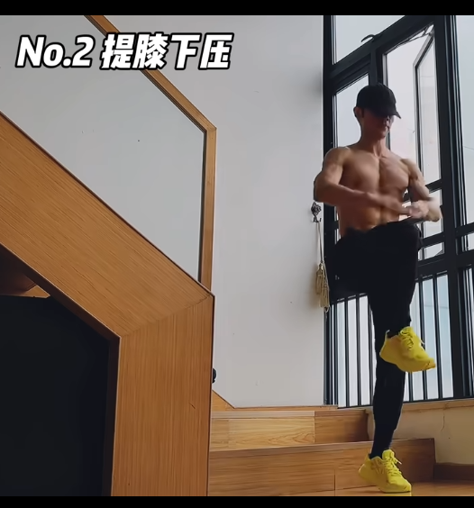
3. 对侧提膝：https://www.bilibili.com/video/BV1oQTnzXEDr?t=78.8
    * 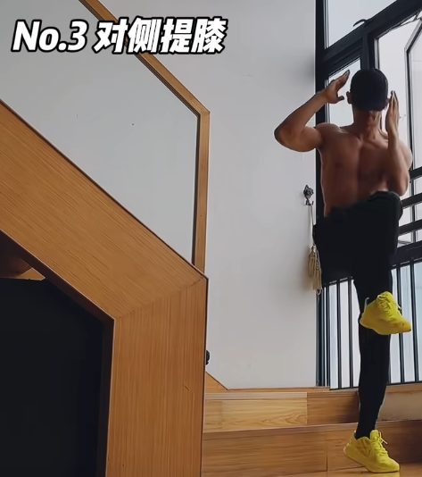
4. 同侧提膝：https://www.bilibili.com/video/BV1oQTnzXEDr?t=102.4
    * 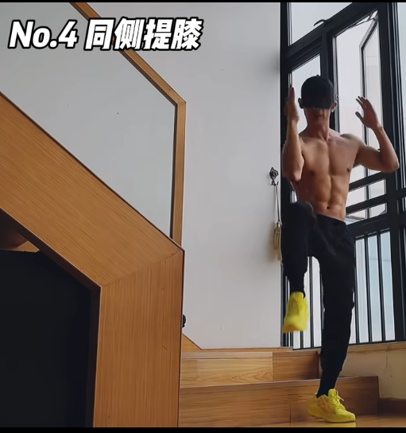
5. 毽子步：https://www.bilibili.com/video/BV1oQTnzXEDr?t=130.1
    * 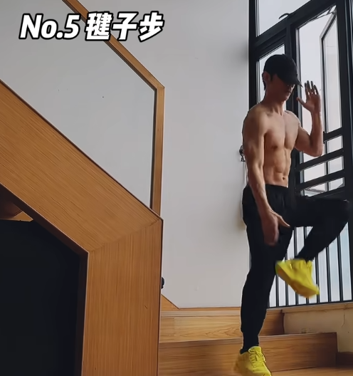
6. 外侧毽子步：https://www.bilibili.com/video/BV1oQTnzXEDr?t=160.7
    * 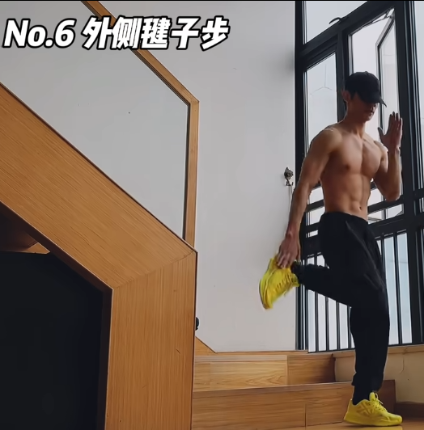
7. 冲拳抬腿：https://www.bilibili.com/video/BV1oQTnzXEDr?t=189.5
    * 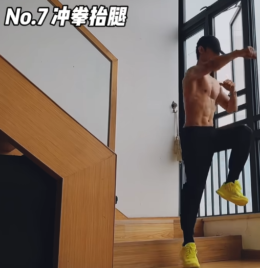
8. 前踢腿：https://www.bilibili.com/video/BV1oQTnzXEDr?t=225.4
    * 
9. 提膝拍脚尖：https://www.bilibili.com/video/BV1oQTnzXEDr?t=265.1
    * 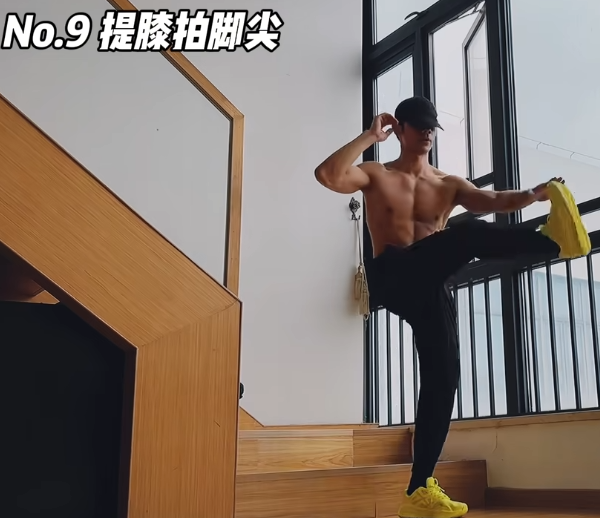
10. 平举后点地：https://www.bilibili.com/video/BV1oQTnzXEDr?t=292.2
    * 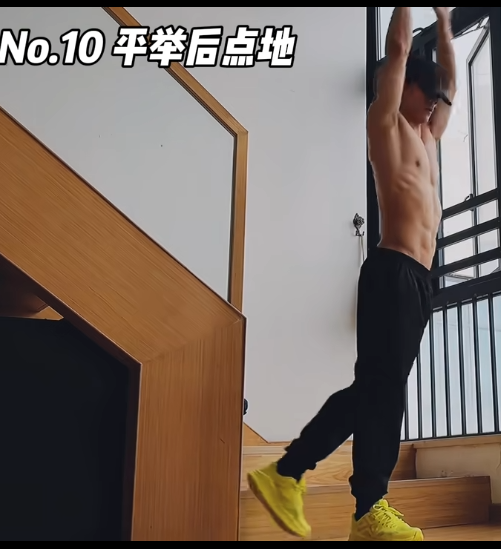
11. 下拉后勾腿：https://www.bilibili.com/video/BV1oQTnzXEDr?t=319.3
    * 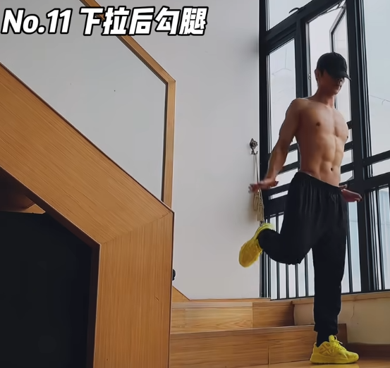
12. 冲拳侧抬腿：https://www.bilibili.com/video/BV1oQTnzXEDr?t=340.9
    * 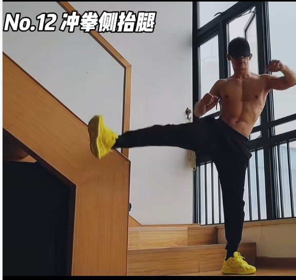
13. 侧抬腿击掌：https://www.bilibili.com/video/BV1oQTnzXEDr?t=373.8
    * 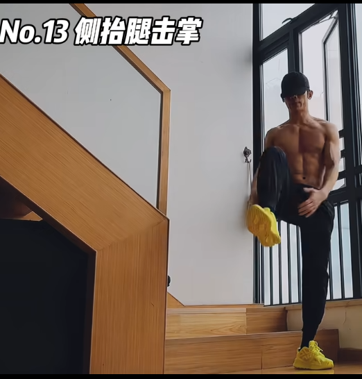
14. 侧位半蹲：https://www.bilibili.com/video/BV1oQTnzXEDr?t=400.2
    * 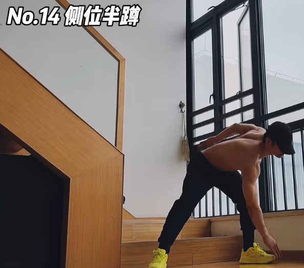
15. 抬腿转体：https://www.bilibili.com/video/BV1oQTnzXEDr?t=431.8
    * 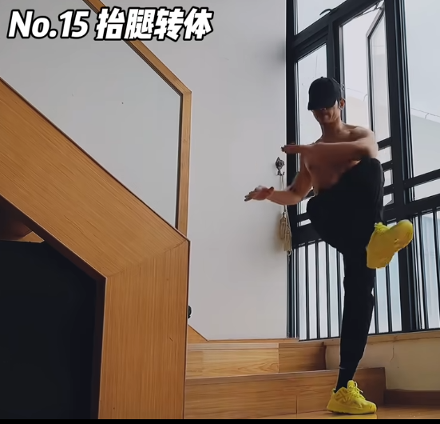
16. 交叉步：https://www.bilibili.com/video/BV1oQTnzXEDr?t=464.7
    * 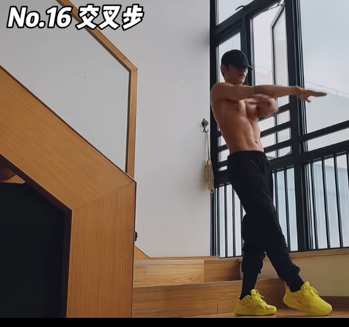
17. 提膝下拉：https://www.bilibili.com/video/BV1oQTnzXEDr?t=490.9
    * 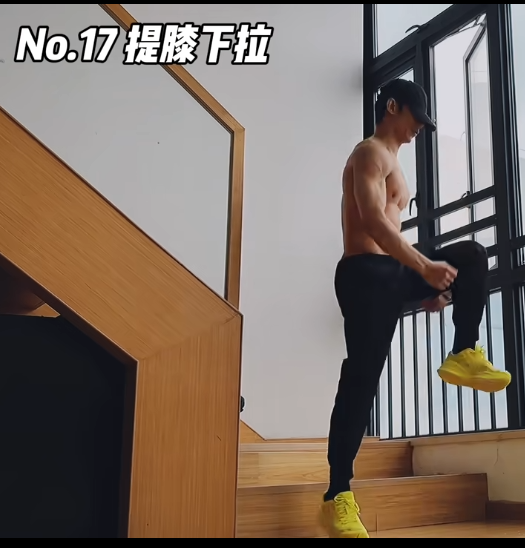
18. 夹背后勾腿：https://www.bilibili.com/video/BV1oQTnzXEDr?t=521.3
    * 
19. 提膝拍膝：https://www.bilibili.com/video/BV1oQTnzXEDr?t=552.0
    * 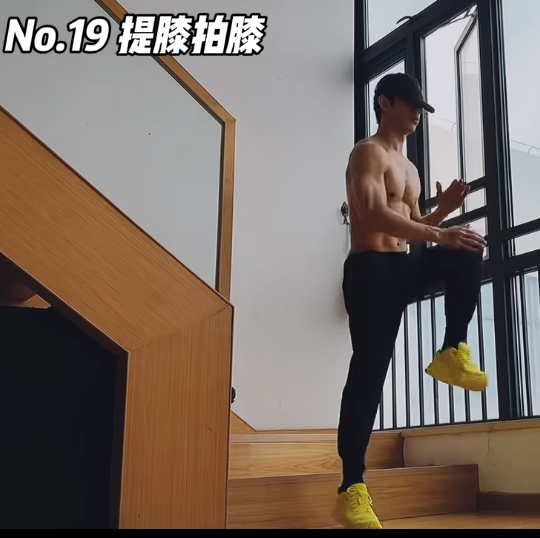
20. 摆臂后勾腿：https://www.bilibili.com/video/BV1oQTnzXEDr?t=583.5
    * 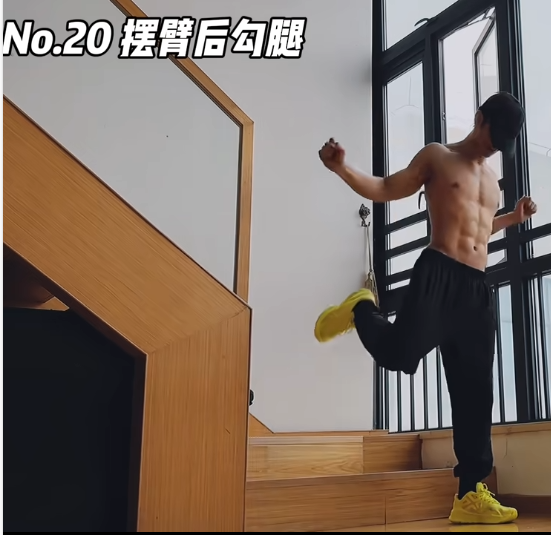
21. `前踢腿`：https://www.bilibili.com/video/BV1oQTnzXEDr?t=610.5
    * 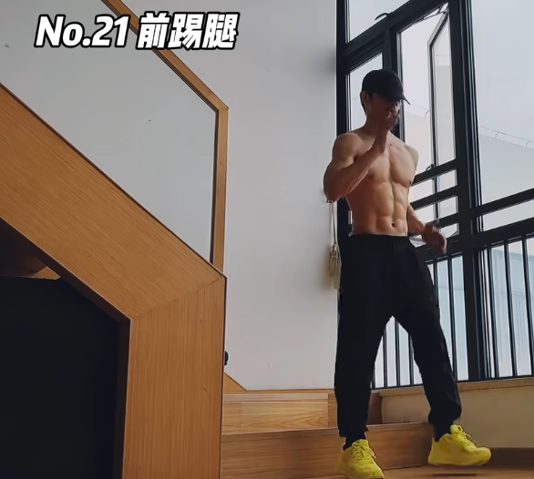
22. 交替侧踢：https://www.bilibili.com/video/BV1oQTnzXEDr?t=645.1
    * 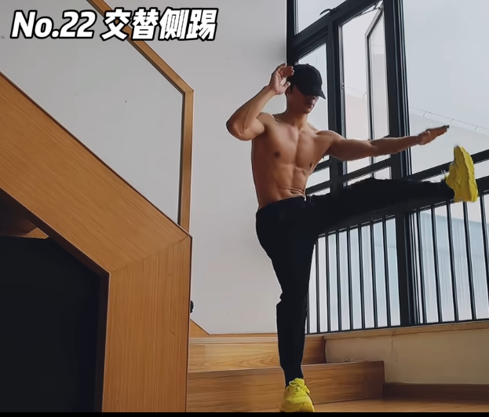
23. 站姿卷腹：https://www.bilibili.com/video/BV1oQTnzXEDr?t=671.9
    * 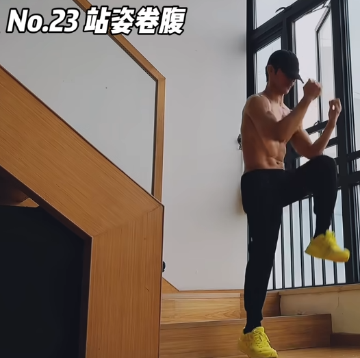
24. 冲拳转髋：https://www.bilibili.com/video/BV1oQTnzXEDr?t=705.0
    * 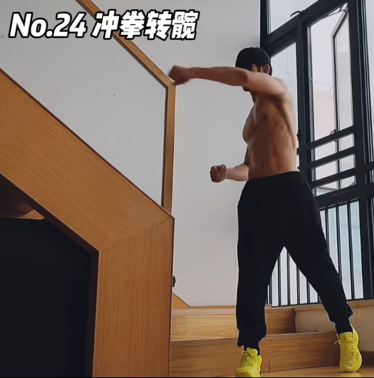
25. `提膝下压`：https://www.bilibili.com/video/BV1oQTnzXEDr?t=729.4
    * 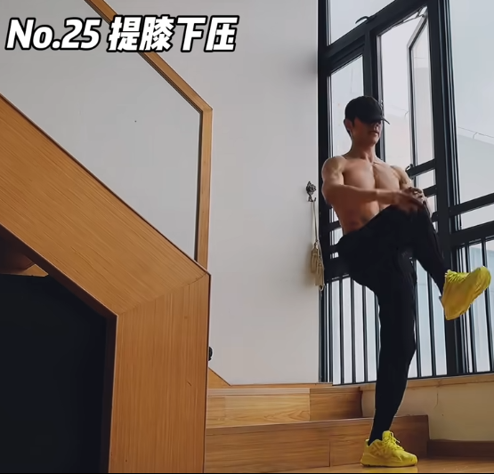
26. 开合跳：https://www.bilibili.com/video/BV1oQTnzXEDr?t=760.5
    * 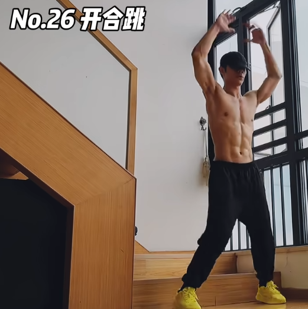
27. `胯下击掌`：https://www.bilibili.com/video/BV1oQTnzXEDr?t=789.8
    * 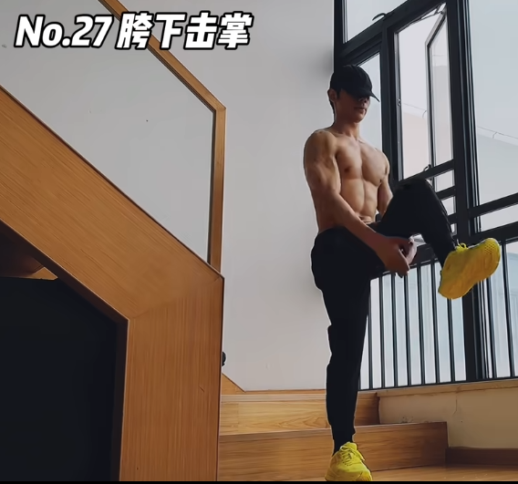
28. 星形跳：https://www.bilibili.com/video/BV1oQTnzXEDr?t=823.9
    * 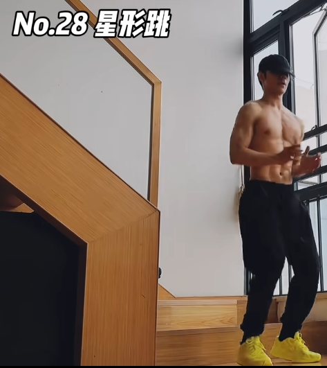
29. 提膝触肘：https://www.bilibili.com/video/BV1oQTnzXEDr?t=850.4
    * 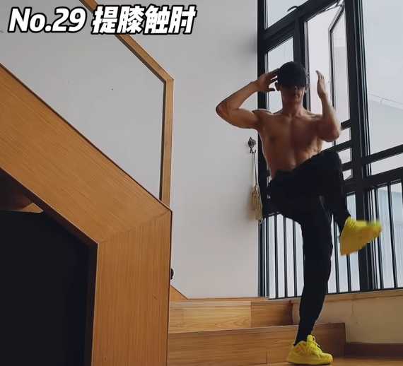
30. `同侧提膝`：https://www.bilibili.com/video/BV1oQTnzXEDr?t=885.5
    * 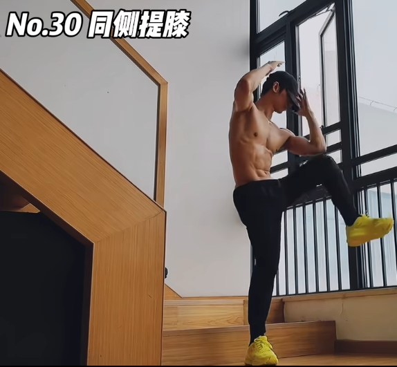
31. `侧抬腿击掌`：https://www.bilibili.com/video/BV1oQTnzXEDr?t=910.1
    * 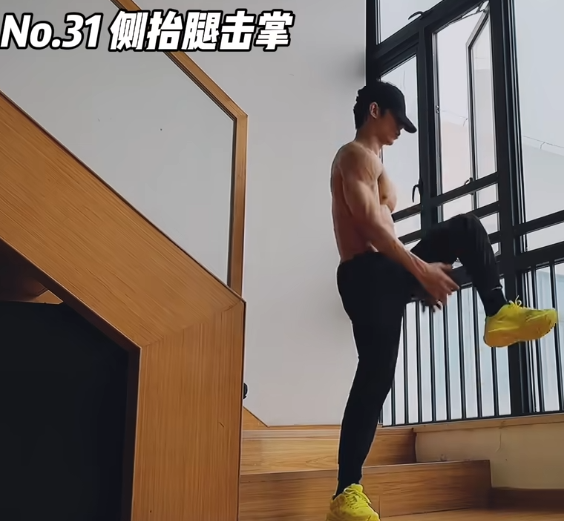
32. 抬臂开合跳：https://www.bilibili.com/video/BV1oQTnzXEDr?t=941.0
    * 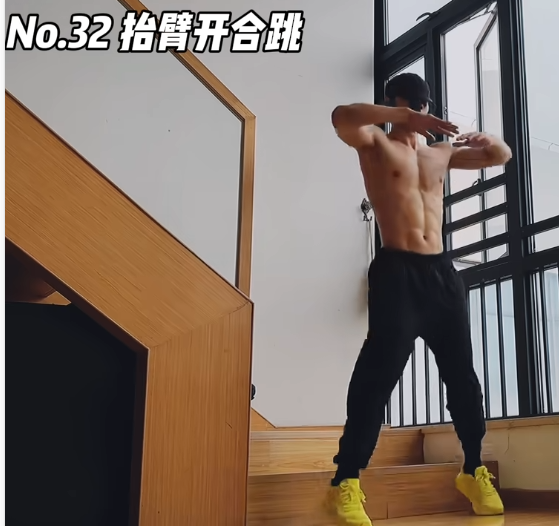
33. `外侧毽子步`：https://www.bilibili.com/video/BV1oQTnzXEDr?t=970.4
    * 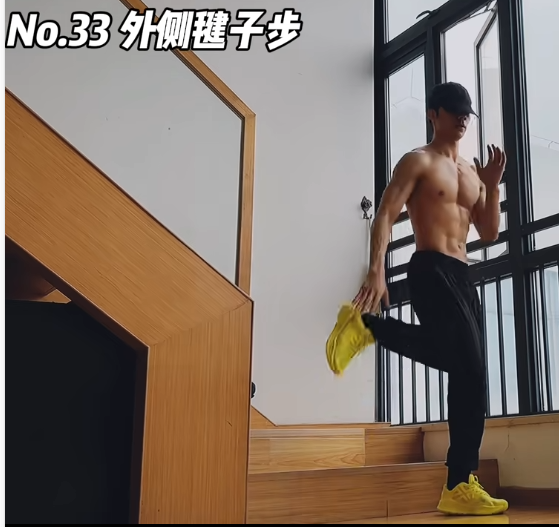
34. `毽子步`:https://www.bilibili.com/video/BV1oQTnzXEDr?t=1000.4
    * 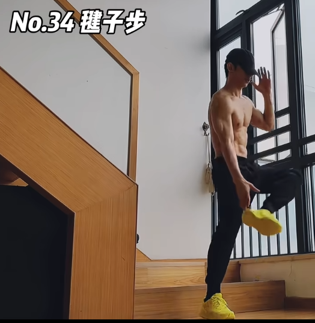
35. `对侧提膝`：https://www.bilibili.com/video/BV1oQTnzXEDr?t=1037.3
    * 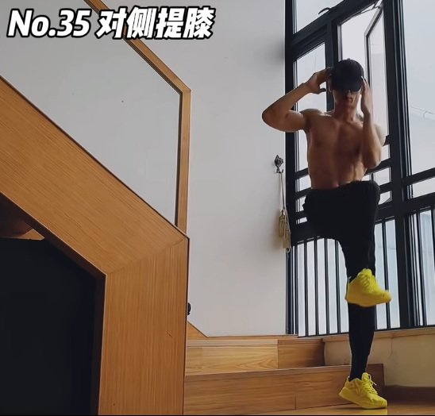
36. `胯下击掌`：https://www.bilibili.com/video/BV1oQTnzXEDr?t=1059.6
    * 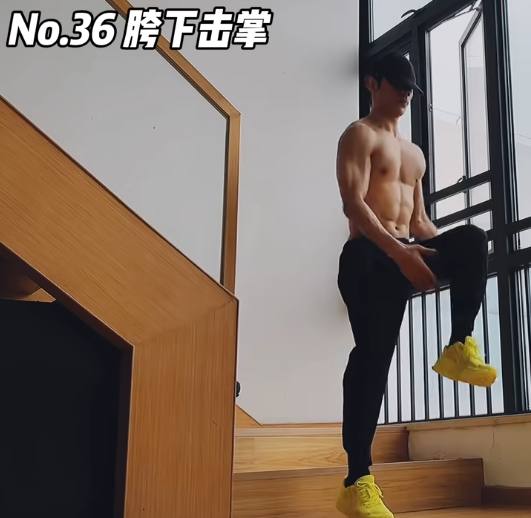
37. `同侧提膝`：https://www.bilibili.com/video/BV1oQTnzXEDr?t=1090.5
    * 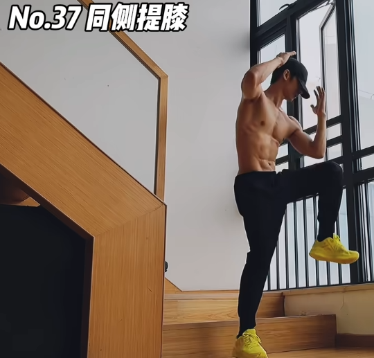
38. 抱膝抬腿：https://www.bilibili.com/video/BV1oQTnzXEDr?t=1120.6
    * 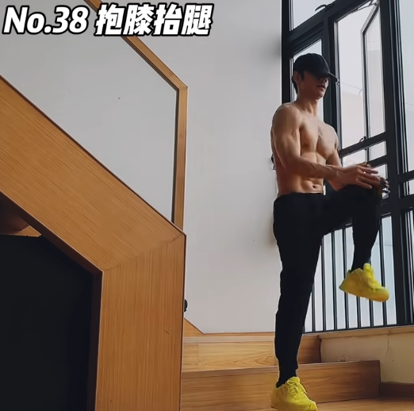
39. 深蹲：https://www.bilibili.com/video/BV1oQTnzXEDr?t=1152.7
    * 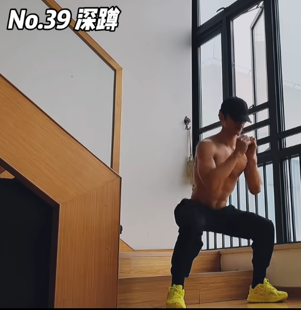
40. 高抬腿：https://www.bilibili.com/video/BV1oQTnzXEDr?t=1179.6
    * 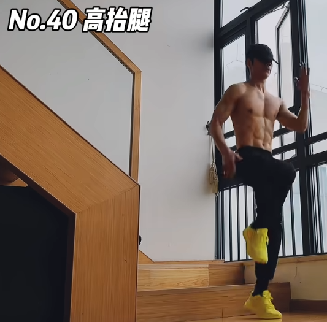
41. `前踢腿`：https://www.bilibili.com/video/BV1oQTnzXEDr?t=1213.1
    * 
42. `提膝拍膝`：https://www.bilibili.com/video/BV1oQTnzXEDr?t=1246.4
    * 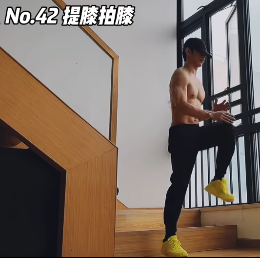
43. `胯下击掌`：https://www.bilibili.com/video/BV1oQTnzXEDr?t=1270.2
    * 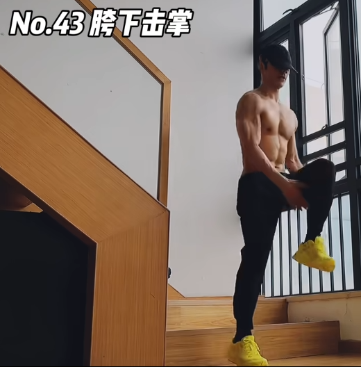
44. `提膝触肘`：https://www.bilibili.com/video/BV1oQTnzXEDr?t=1303.8
    * 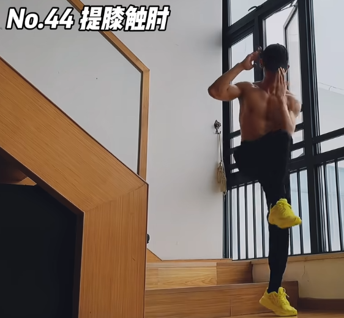
45. `同侧提膝`：https://www.bilibili.com/video/BV1oQTnzXEDr?t=1333.1
    * 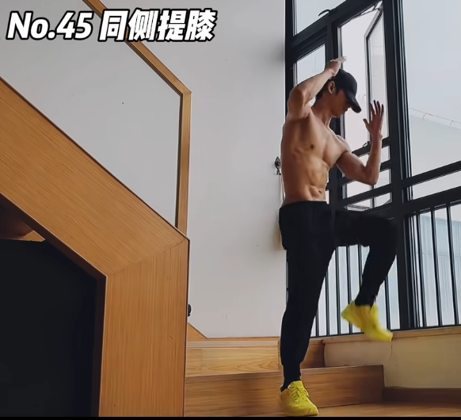
46. `提膝下压`：https://www.bilibili.com/video/BV1oQTnzXEDr?t=1364.0
    * 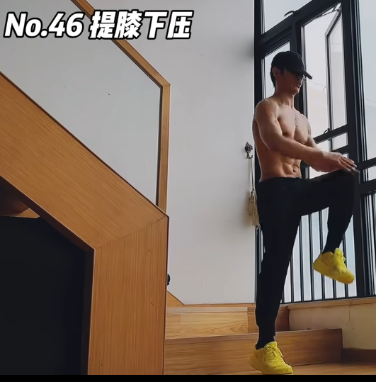
47. `抱膝抬腿`：https://www.bilibili.com/video/BV1oQTnzXEDr?t=1392.3
    * 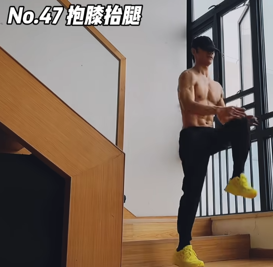
48. `提膝下拉`：https://www.bilibili.com/video/BV1oQTnzXEDr?t=1422.0
    * 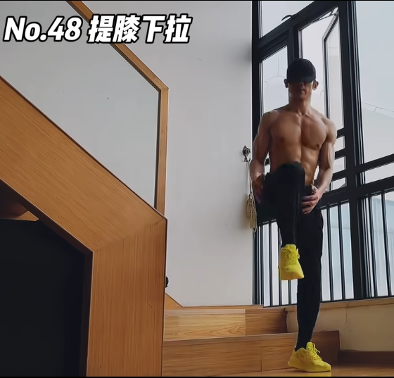
49. 伸手侧抬腿：https://www.bilibili.com/video/BV1oQTnzXEDr?t=1454.1
    * 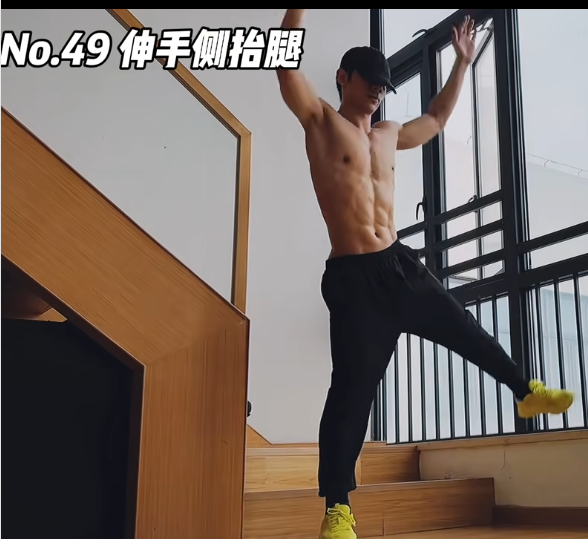
50. `提膝拍脚尖`:https://www.bilibili.com/video/BV1oQTnzXEDr?t=1484.0
    * 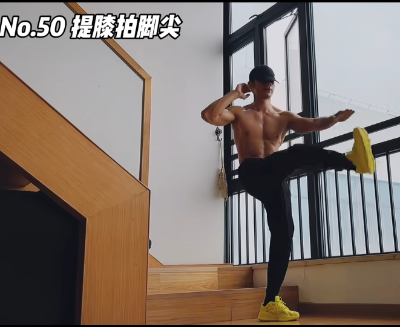
51. `夹背后勾腿`：https://www.bilibili.com/video/BV1oQTnzXEDr?t=1514.1
    * 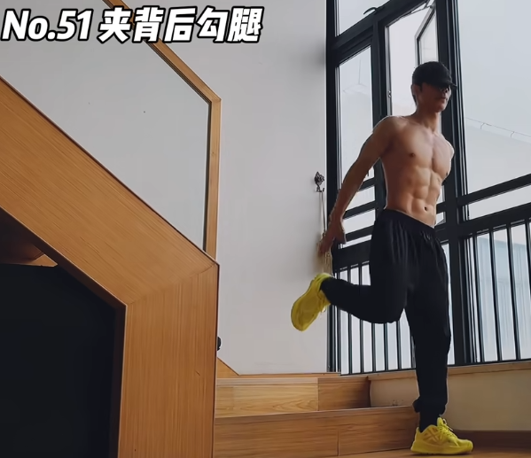
52. `抬腿转体`：https://www.bilibili.com/video/BV1oQTnzXEDr?t=1540.9
    * 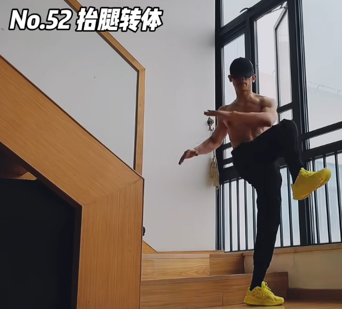
53. `交叉步`：https://www.bilibili.com/video/BV1oQTnzXEDr?t=1573.6
    * 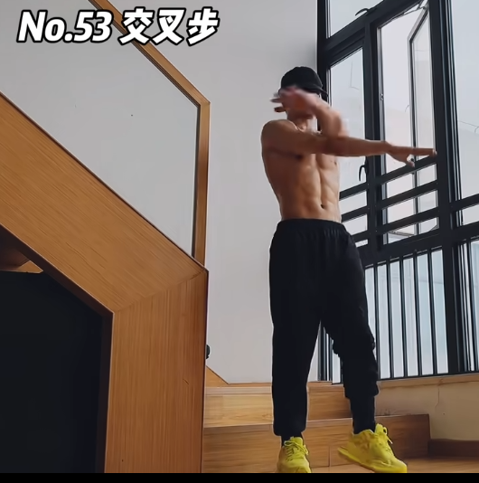
54. `侧抬腿击掌`：https://www.bilibili.com/video/BV1oQTnzXEDr?t=1612.5
    * 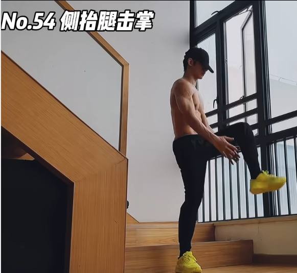
55. `对侧提膝`：https://www.bilibili.com/video/BV1oQTnzXEDr?t=1637.6
    * 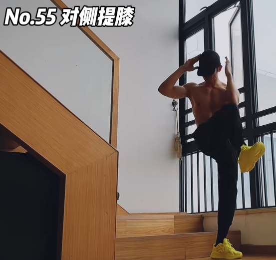
56. `开合跳`：https://www.bilibili.com/video/BV1oQTnzXEDr?t=1666.8
    * 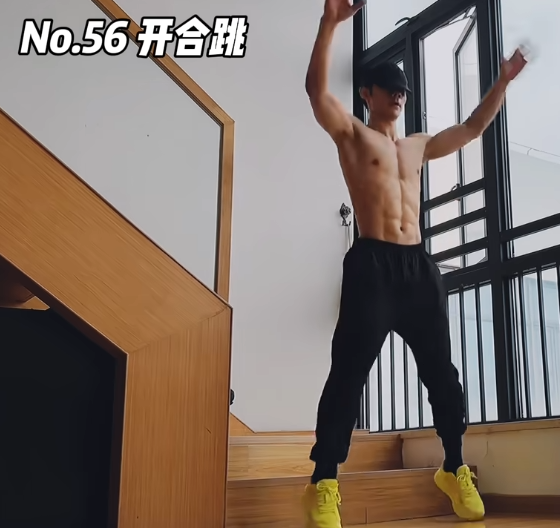
57. `深蹲`：https://www.bilibili.com/video/BV1oQTnzXEDr?t=1695.4
    * 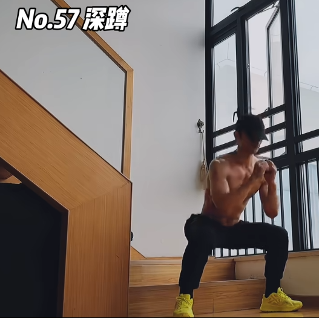
58. `胯下击掌`：https://www.bilibili.com/video/BV1oQTnzXEDr?t=1728.7
    * 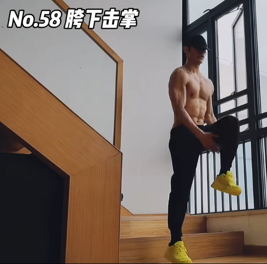
59. 后勾腿跳：https://www.bilibili.com/video/BV1oQTnzXEDr?t=1751.8
    * 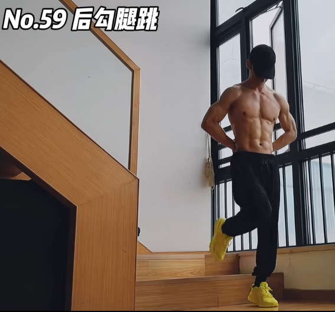
60. `对侧提膝`：https://www.bilibili.com/video/BV1oQTnzXEDr?t=1785.2
    * 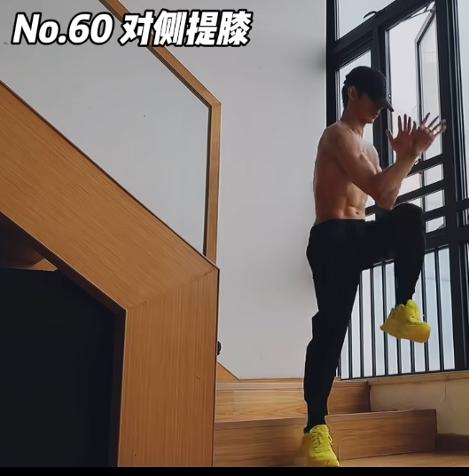
61. `提膝下压`：https://www.bilibili.com/video/BV1oQTnzXEDr?t=1812.0
    * 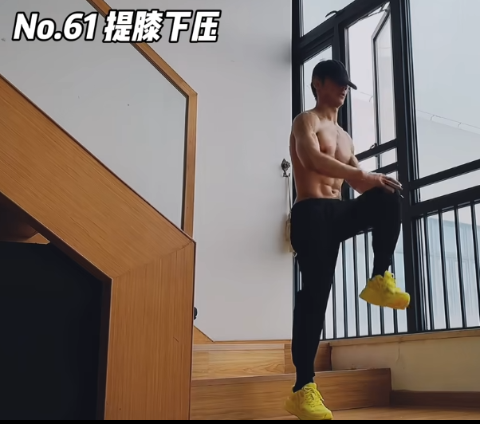
62. `开合跳`：https://www.bilibili.com/video/BV1oQTnzXEDr?t=1843.0
    * 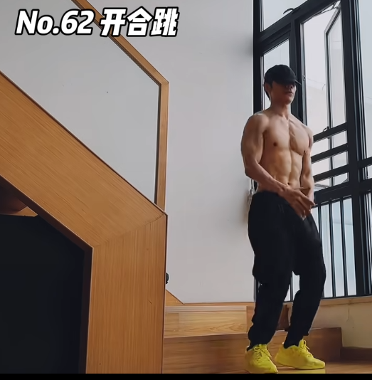
63. 深蹲跳：https://www.bilibili.com/video/BV1oQTnzXEDr?t=1870.7
    * 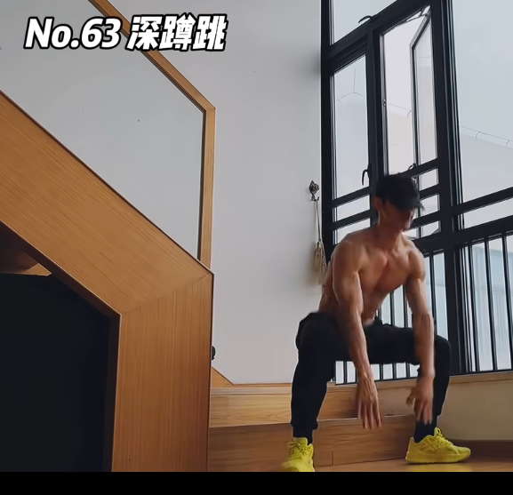
    * 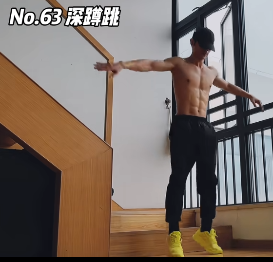
64. `高抬腿`：https://www.bilibili.com/video/BV1oQTnzXEDr?t=1902.2
    * 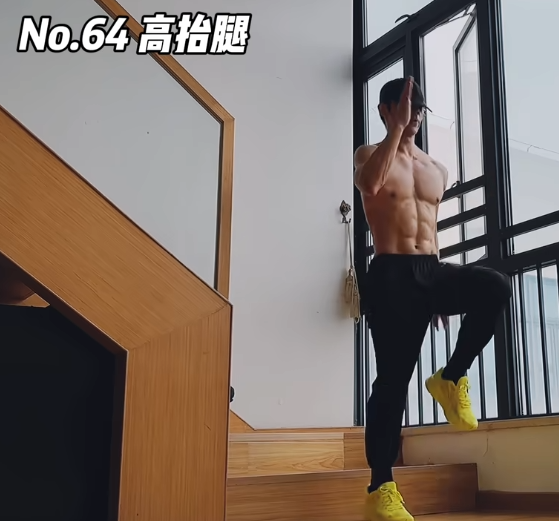